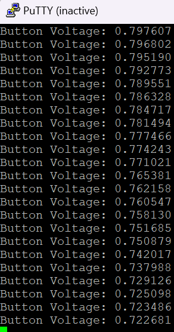
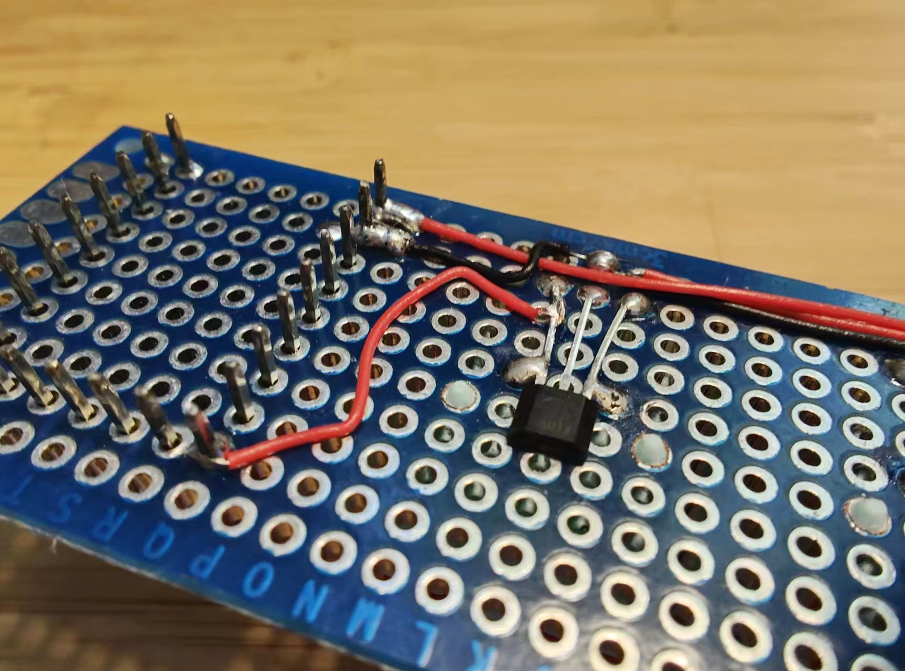
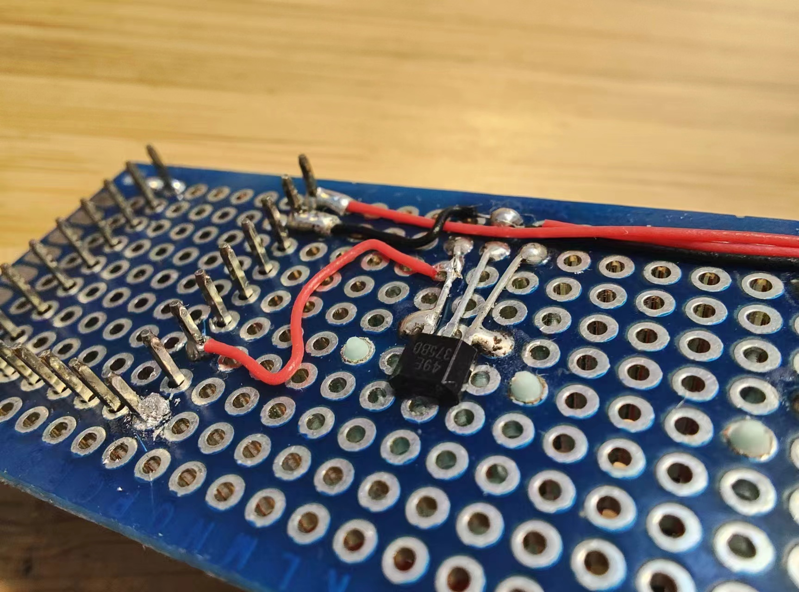
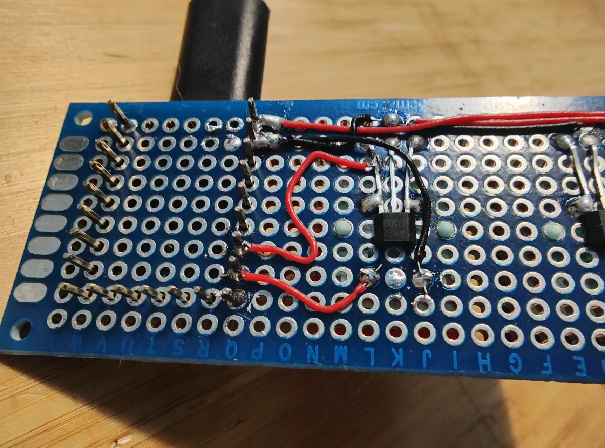
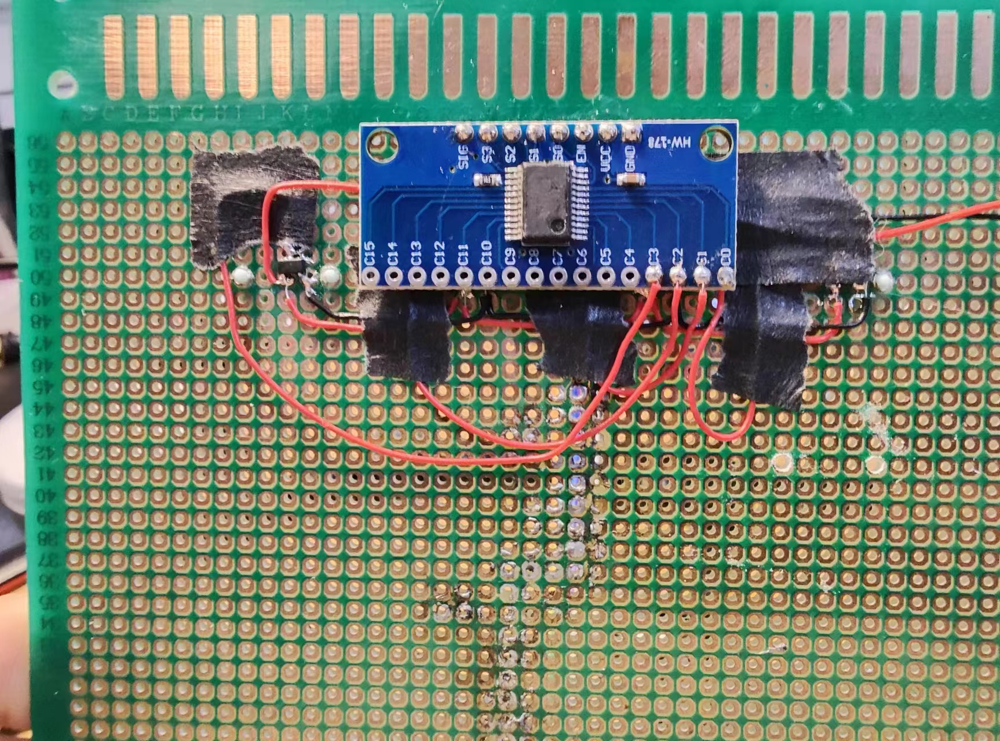
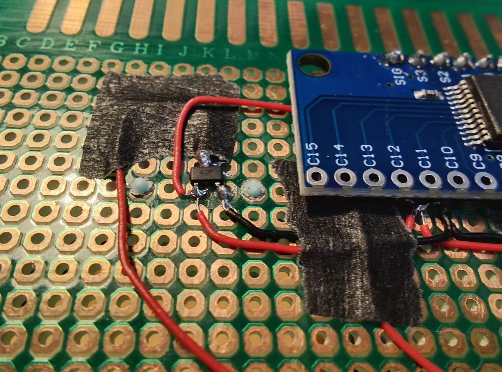
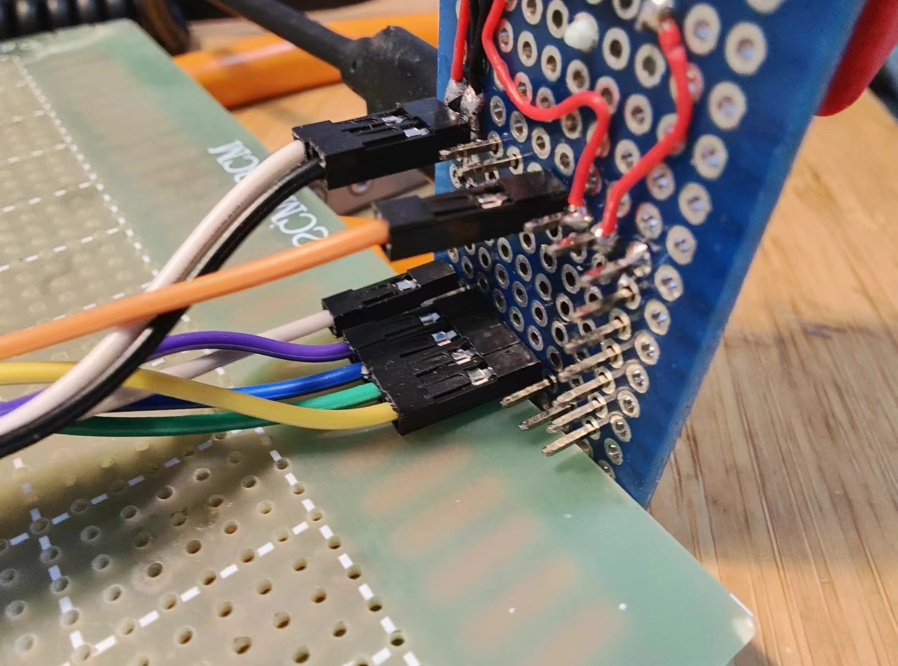
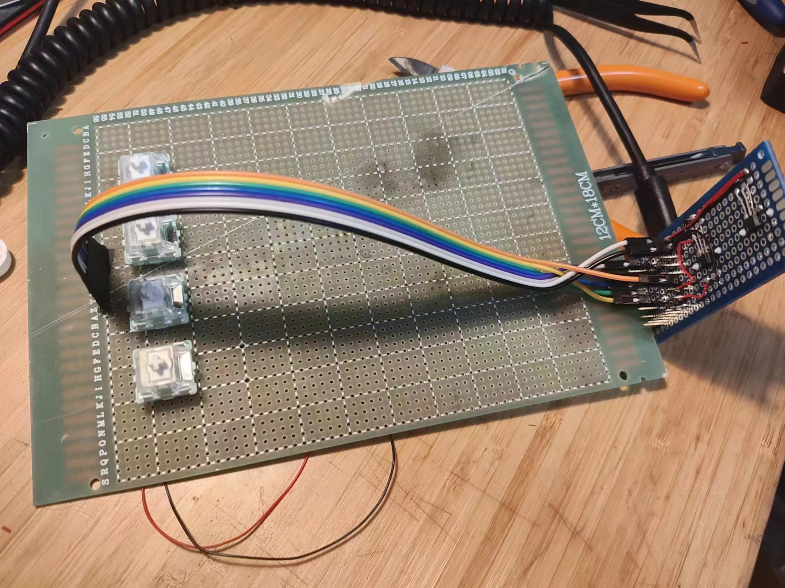
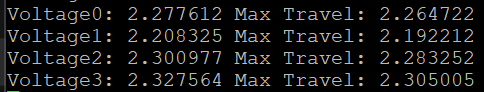

First succesful read from the RP2040 Zero!

Rewiring so the sensor actually connects to a ADC pin.

fount issue after looking through the readings, the response rate is sooooo high that Putty is lagging behind.
- Add delay in the code to be able to read the response from the RP2040 Zero.

Add LED so press can be indicated.

<video controls src="9f4c904f82cfbd49c51999def69761d6.mp4" title="Title"></video>

Started prototyping for the multichannel switcher module.
And actually finished it!

not working after adding the multiplexer, debugging...

it looks like the sot-23 version of the hall effect sensor requires a higher working voltage.
fuck I thought it was the same and connected the multipler (which works at 5V) with the hall effect sensor (which works at 8V) in series.

probed the multiplexer with a sin wave as a input, verified that it is working.
now it seems that the issue is with the hall effect sensor.

FUCKKKKKKK.
Guess that's my fault.
I soldered the wrong ground pin on the hall effect sensor. PLUS, it doesn't need 8V, 5 should be enough.
The pinout for the sensor has two verion, one with SOT-23 and another one is SIP.

Now I gotta desolder the whole shit and redo it. FINE.

Rewired, everthing is working as expected.

However, the readings are off, the response is slow? or i could even say it's just random values.

Did some more testing, found out that is because I'm constantly calling changes to adc_select_input() function, which is causing the some lagging, could be solves using the round robin approach, i bet.
The working code is out.

But I didn't test the round robin approach yet, the last photo was a using a single ADC pin with multiplexer doing its job.

I'll test the round robin approach and update the code.

That's the end for today...

