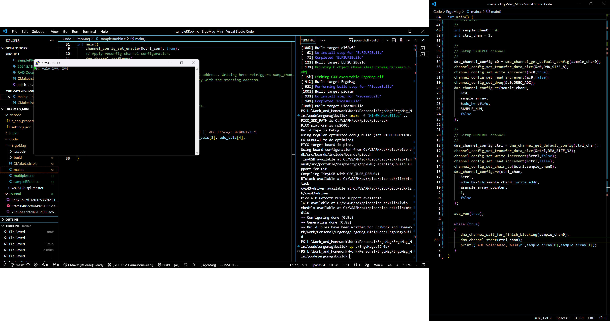

I've just realised that I need some sort of a software schematic
Because I'll probably be using Multicore and DMA, 1 core used for transfering serial information and another one used for calculating keypress.
I'll have to make a schedule of every process.

However, I believe I'll be using Rapid Application Development.
I will first specify my requirements

FFFFFFFFFFFFFFFFFFFFF yeah

finally got it.

At first the there was reading but the order was wrong.
Then I tried some code a guy post online that worked for him. However it didn't seem to work for me as non values were printing out in serial monitor.
Then I realised it might be a clock mismatch problem. ADC value producing speed != DMA grabing speed or DMA grabing speed != printf reading array (main thread) speed.

So I looked carefully into the freaking documentation and found `dma_channel_wait_for_finish_blocking()`, this worked perfectly for me. 

But this method is Blocking, which stops cpu from doing other stuff, though I'm really just going to grab readings from 4 MUX at the same time so 4 Blocking for 1 core I think that's ok.

