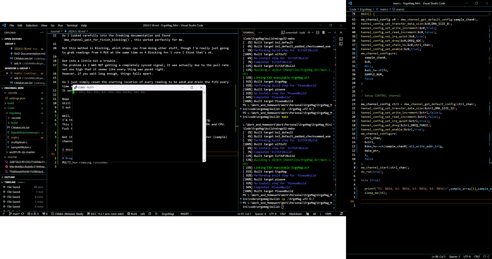

I've just realised that I need some sort of a software schematic
Because I'll probably be using Multicore and DMA, 1 core used for transfering serial information and another one used for calculating keypress.
I'll have to make a schedule of every process.

However, I believe I'll be using Rapid Application Development.
I will first specify my requirements

FFFFFFFFFFFFFFFFFFFFF yeah

finally got it.

At first the there was reading but the order was wrong.
Then I tried some code a guy post online that worked for him. However it didn't seem to work for me as non values were printing out in serial monitor.
Then I realised it might be a clock mismatch problem. ADC value producing speed != DMA grabing speed or DMA grabing speed != printf reading array (main thread) speed.

So I looked carefully into the freaking documentation and found `dma_channel_wait_for_finish_blocking()`, this worked perfectly for me. 

But this method is Blocking, which stops cpu from doing other stuff, though I'm really just going to grab readings from 4 MUX at the same time so 4 Blocking for 1 core I think that's ok.

Got into a little bit a trouble.
The problem is I WAS NOT getting a completely synced signal; It was actually due to the pull rate set soo high that it seems like every thing was paced right.
However, if you wait long enough, things falls apart.

So I just simply reset the starting location of every reading to be adc0 and drain the fifo every time a new reading starts.
It works!

Nope
Still it only helps a bit but doesn't resolve the problem.
1 out of 1000 sample (probably) still has this bloody problem.

Well, This is just dissapointing
I'm thinking I can't actually solve this quickly, might need a little bit more digging.
This is complicated, or I think it is, as it involves syncing data between ADC and DMA and CPU. Fuck this I hate it.

Got it working by adding irq_quiet and using a dma_channel (control) to trigger another (sample) channel. This works but I still don't understand what is the reason behind this.

I think I finally got the code I'll be using later.

# Progress Check
MULTI_Mux reading finished.
